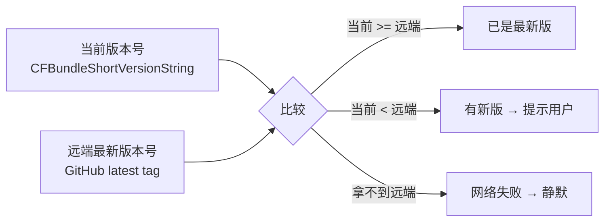
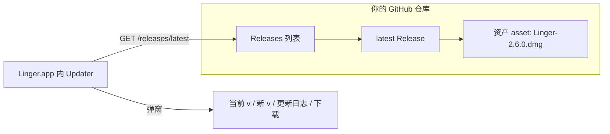
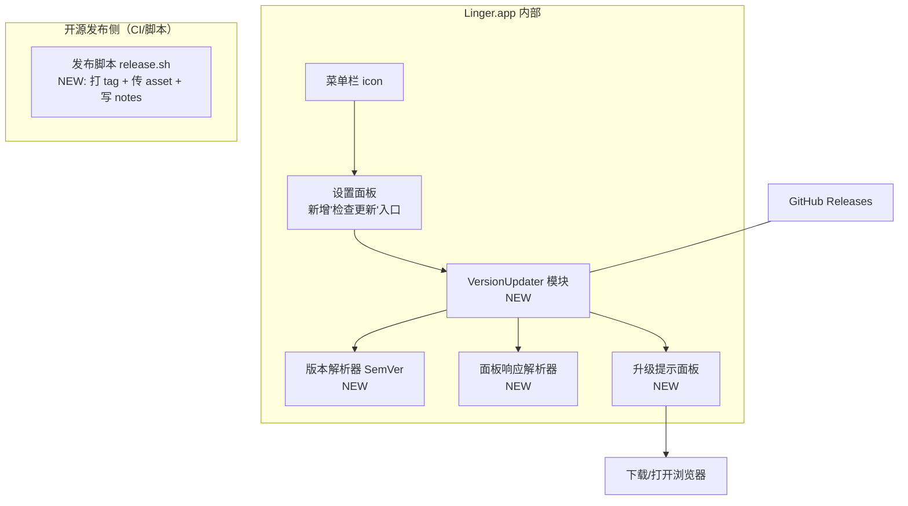
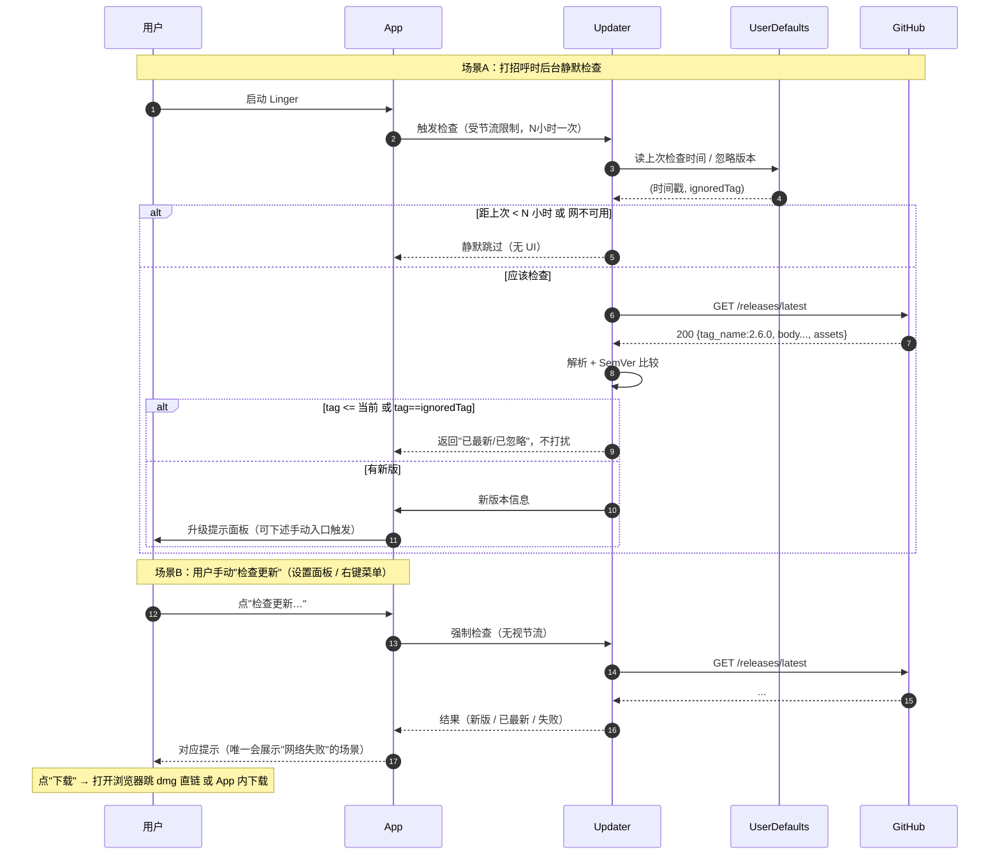
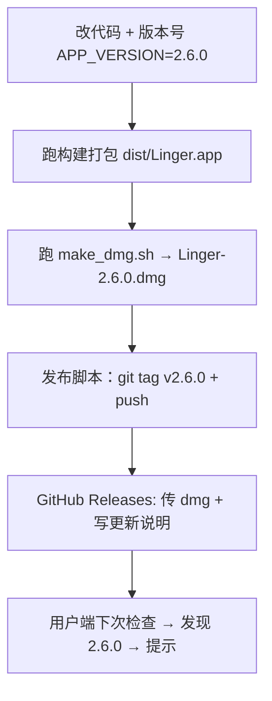

# Linger 检查更新 · 方案设计文档

> 目标：Linger 开源到 GitHub 后，用户能得知并获取新版本。
> 本文只讲逻辑、原理、缺什么；不贴实现代码。
> 状态：**方案评审稿**（2026-08-24）

---

## 0. 一句话结论

你不一定需要 Sparkle。以你当前的形态（**SwiftPM + 无签名 + 脚本手搓 bundle + GitHub 分发 .dmg**），
最匹配的方案是 **「GitHub Releases API 检查更新 + 跳转下载」**——零签名依赖、原理简单、完全开源透明。
**Sparkle 自动静默更新**是更高级的目标，但它强依赖代码签名 + 公证，接入门槛高，见 §5 详述代价。

---

## 1. 核心原理：更新 = 两个版本号在比大小

任何「检查更新」系统，本质只有三件事：

**版本号的唯一真源**：当前版本永远读应用的 `Info.plist` 里的 `CFBundleShortVersionString`，
不要在 Swift 代码里再写一份。这样「用户装了什么」就是「app 说自己是什么」，不会漂移。

> ⚠️ Linger 现状的雷：`APP_VERSION` 硬编码在 `build_and_run.sh`。
> 如果做成更新，你要让「构建打包」和「运行时检查」用**同一份**版本号，否则会出现
> 「app 里显示 2.5.0，远端已经 2.6.0，但用户明明装了 2.6.0 却提示更新」的歧义。

---

## 2. 远端源：为什么用 GitHub Releases

GitHub 天然给你一个「带版本号 + 附件的仓库」，是开源项目做更新的标准免费载体。

- **请求地址**：`GET https://api.github.com/repos/{owner}/{repo}/releases/latest`
- **返回 JSON（关键字段）**：`tag_name`（新版本号）、`body`（发布说明，可当更新日志）、`published_at`、`assets[].browser_download_url`（dmg 下载直链）
- **无 Token 也能用**：公开仓库的 latest API 有速率限制（60 次/小时/IP），对「每天启动检查一次」绰绰有余；超限时静默跳过即可，不影响功能
- **为什么不是对比二进制**：开源项目 tag 就是版本唯一标识，Human-friendly 且稳定，比比对文件哈希/大小可靠得多

---

## 3. 整体架构：缺哪些功能模块

现状到「能检查更新」，要补 5 块。这是目标功能和现有模块的映射：

| # | 缺的模块 | 作用 | 依赖 |
|---|---|---|---|
| 1 | **VersionUpdater**（核心） | URLSession 请求 latest API → 拿 JSON 转成「远程版本对象」 | 仅 Foundation |
| 2 | **SemVer 版本解析器** | 把 `2.6.0`、`2.10.0` 拆成数字比较（不是字符串比！否则 `2.10` < `2.9`） | 纯逻辑，可单元测试 |
| 3 | **升级提示面板** | 展示「当前 v → 新 v」+ 更新日志 + 下载/稍后/忽略这版 | AppKit |
| 4 | **策略/缓存层** | 检查频率节流（如 N 小时一次）、«忽略此版本» 持久化到 UserDefaults、网络失败静默 | UserDefaults |
| 5 | **发布脚本**（运维侧） | 一条命令完成：打 tag → 上传 dmg → 填更新说明 | bash + GitHub CLI/API |

**你已有的、能直接复用的部分**：
- `dist/Linger.dmg` 产物体系（`make_dmg.sh`）→ 作为 release **asset**
- Info.plist 生成逻辑（`build_and_run.sh`）→ 在其中注入 `SUFeedURL` 或「GitHub 仓库地址」配置键
- 网络层：新的 VersionUpdater 用 `URLSession`，**和现有代码无冲突**（引擎层本身就是 Foundation-only）

---

## 4. 检查更新的运行时流程（时序化）

---

## 5. 如果要「自动静默更新」：Sparkle 与代价

如果你想做到「检测到新版 → 自己下载 → 原地替换 → 重启后就是新版」，
行业标准是 **Sparkle**。但以你当前工程形态，代价很高，逐条列出再决定：

| 维度 | 现在（方案A：GitHub API 跳转） | Sparkle（自更新） |
|---|---|---|
| 需要代码签名 | ❌ 不需要 | ✅ **必须**。macOS 13+ 未签名 app 内 Sparkle 的提权替换会被 Gatekeeper 拒绝 |
| 签名意义 | 无 | Developer ID **+ 公证（Notarization）**，最好是 Developer ID & Apple 开发者账号（$99/年） |
| 发布物 | .dmg 一个资产 | .dmg + **appcast.xml**（RSS，描述每个版本+下载地址）+ 签名校验 |
| 工程门槛 | SPM 加一个文件 | SPM 引 Sparkle 框架 + 嵌入 XPC 帮助进程 + Info.plist 配 SUFeedURL + 更多配置 |
| 用户体验 | 跳浏览器手动拖 | 无缝自动 |
| 适合 | 开源免费，用户自己装 | 商业或高频更新，追求零摩擦 |

> 判断建议：**作为一个开源免费、用户会自己去 GitHub 下 .dmg 的工具，方案 A 是 80% 收益 20% 成本；
> Sparkle 是剩下 20% 收益但 80% 成本**。建议先用方案 A 上线，需求真到再上 Sparkle。

---

## 6. 发布流程（配合更新用的那条链）

要点：
- **tag 格式建议 `v2.6.0`**，与 `CFBundleShortVersionString` 数字对齐（API 返回的 `tag_name` 去掉前缀 `v` 再比较）
- **更新说明 = Release 的 body**，直接复用为弹窗里的「本次更新」内容，不用二次维护
- 发布脚本把「打 tag / 上传」固化，避免手滑漏传资产或写错版本

---

## 7. 术语对照（方便你和协作者对齐）

| 术语 | 含义 |
|---|---|
| Releases | GitHub 的带版本号发布区块 |
| asset / 资产 | Release 下挂的下载文件（你的 .dmg） |
| tag / 标签 | git 里指向某次提交的名字，做版本锚点 |
| appcast | Sparkle 专属的 RSS 更新描述文件（方案 B 才用） |
| SemVer | 语义化版本 `主.次.修订`，比较时逐段比数字 |
| Notarization | Apple 公证；配合硬签名解决「未受信任开发者」弹窗 |

---

## 8. 结论 & 行动清单

**推荐执行顺序（先做 1，再看 2）**：

1. **方案 A（上线用）**：加 VersionUpdater + SemVer 解析 + 升级提示面板 + 设置菜单「检查更新」入口 + 发布脚本。零签名依赖，一次做完即可用。
2. **版本号去重**（无论做不做都必须）：让构建脚本和运行时读同一份版本号，杜绝两套数字漂移。
3. **以后可选**：等真的需要无缝自动更新，再评估 Sparkle + Developer ID + 公证。

**一句话原理**：你的 app 每次（或手动）问一下 GitHub「你的最新版本号是多少」，
用 SemVer 和它自己 Info.plist 里的当前版本比，比不过就弹个窗告诉用户去哪下。就这么多。