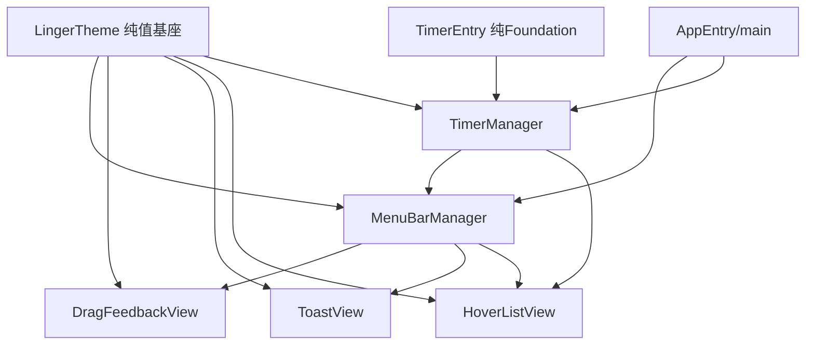
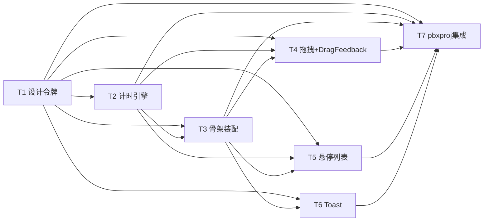
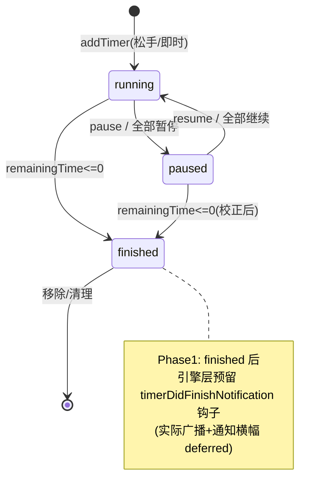
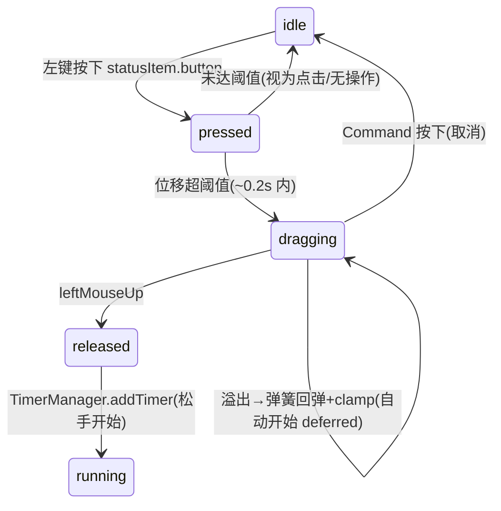

# Linger 2.1 — Phase 1 绿地版架构蓝图

> **角色**：架构师 高见远（software-architect）
> **产出类型**：绿地重建架构蓝图 + 目标文件清单 + 共享约定 + 有序任务分解（**仅设计，不含任何 Swift 实现代码**）
> **阶段**：Phase 1（可运行骨架 + 拖拽计时 01/02 + 悬停列表 03 + 计时引擎 + 统一设计令牌）
> **平台**：macOS 13+，纯 AppKit（不依赖 SwiftUI），原生菜单栏应用（`NSStatusItem`），Release 用 `.accessory` 激活策略
> **总原则**：**100% 从规格重写，严禁读取或复用 `/Users/dawang/Downloads/vibecoding/Linger2.0/` 下任何旧代码**；旧版 bug 多、界面不一致，已被用户放弃。

---

## 0. 理解要点复述（先读）

1. **绿地重建**：本次是 `Linger2.1`，从 PRD / 关联描述 / 三页原型 HTML 完全重写，不搬 2.0 任何一行代码。
2. **技术铁律**：纯 AppKit、`macOS 13+`、`NSStatusItem`；Release `.accessory`，Debug `.regular`（编译期宏区分）。
3. **Phase 1 范围**（用户拍板）：
   - 可运行骨架（菜单栏出现 + 右键菜单 + 基础装配）
   - 拖拽计时（原型 01 空闲 / 02 拖拽）
   - 悬停计时列表（原型 03）
   - 计时引擎（`TimerEntry` + `TimerManager`）
   - 统一设计令牌（`LingerTheme`）
4. **明确 deferred（本次不做，蓝图标 deferred）**：通知系统（06R）、日历集成（09/11）、设置窗口（07–10）、关于窗口（11）、预约计时浮窗（07R/07A）、图标三风格 Ring/Classic/timer 切换、双轨模式/溢出自动开始的切换 UI。
5. **工程落点**：`Linger2.1/Linger/Linger.xcodeproj/` + 源码 `Linger2.1/Linger/Linger/*.swift`（嵌套两层 `Linger`，模仿旧版布局但内容全新）。
6. **铁律写入蓝图**（违反即 bug）：
   - `NSTrackingArea` 的 owner **必须是 NSView 子类**，不能用 controller。
   - `NSEvent.addLocalMonitorForEvents` **仅用于拖拽阶段**；状态栏按钮点击走 target/action。
   - 拖拽用 timer 轮询（~30fps），不用 `while` 循环（避免主线程阻塞）。
   - 所有 UI 操作在主线程；持久化异步保存，不阻塞 UI。
   - 全工程视图**禁止硬编码 `#F5A623`**，统一走 `LingerTheme` 令牌。
7. **本环境无 Xcode**：只能做纯 Foundation 逻辑单测（`swift test`）；所有 GUI / ⌘R 行为必须由工程师在本机 Xcode 验收。pbxproj 由工程师按本规划生成，用户最终在 Xcode 打开验收。

---

## 1. Phase 1 目标文件清单

> 路径相对 `Linger2.1/Linger/Linger/`。Phase 1 核心 **9 个文件**；`ClickHintView.swift` 列为候选、标注 **deferred**（Phase 1 不需要，拖拽提示文案并入 `DragFeedbackView`）。

| # | 文件 | 职责 | 纯 Foundation（可 `swift test`） | 依赖 AppKit | 备注 |
|---|------|------|:---:|:---:|------|
| 1 | `main.swift` | `NSApplication` 启动入口（`NSApplicationMain` / `@main`） | ✅（NSApplication 属 AppKit，但仅入口，无业务逻辑） | ✅ | 极薄，无业务逻辑 |
| 2 | `AppEntry.swift` | `AppDelegate`：编译期 debug 检测决定 `.regular`/`.accessory`；初始化 `TimerManager` / `MenuBarManager`；注册菜单栏 | ❌ | ✅ | 顶层装配 |
| 3 | `TimerEntry.swift` | 计时实体 + `TimerEntryDTO` + `displayTime(format:)`；**纯 Foundation**；`displayTime` 接受 format 参数注入便于测试；含纯函数 `duration(fromDragDistance:)` / `snapToMinuteIfClose(_:)`（供拖拽映射与单测） | ✅ | ❌ | 不 import AppKit，可进测试 target |
| 4 | `TimerManager.swift` | 计时引擎：增删 / 暂停·继续 / 批量暂停 / 每秒 tick / 状态广播 / 持久化（JSON，异步）/ 10 并发上限 / 恢复；单例 | ✅（主要 Foundation） | ❌ | 持久化用 `FileManager`，CLI 可跑 |
| 5 | `LingerTheme.swift` | 琥珀金阶梯色 / 字体 / 圆角 / 8pt 间距 / 动画时长 + `UserDefaultsKey` 枚举 + 通知名常量；**纯值，无副作用** | ✅ | ❌ | 全工程唯一颜色真相源 |
| 6 | `MenuBarManager.swift` | 状态栏装配（Ring 图标 + 倒计文字）+ 拖拽状态机 + 悬停协调 + Toast 触发 + 窗口装配；顶层协调者 | ❌ | ✅ | 依赖 `TimerManager` + 各 View + `LingerTheme` |
| 7 | `DragFeedbackView.swift` | 双轨拖拽反馈视图（`for`/`til` 标签 + 琥珀金发光竖线 + 圆点 + 弹簧线宽 + 悬停左右切换高亮）；从 `MenuBarManager` 抽出独立 `NSView` 子类 | ❌ | ✅ | owner 自身即 NSView 子类 ✅ |
| 8 | `ToastView.swift` | 居中 Toast（淡入 0.4s → 停留 2.5s → 淡出）；非阻塞、不抢焦点 | ❌ | ✅ | 由 `MenuBarManager` 触发（如达 10 上限） |
| 9 | `HoverListView.swift` | 悬停计时列表：`NSVisualEffectView` 毛玻璃面板；三组排序（计中→分隔→暂停→分隔→未开始）+ 琥珀金进度条 + 暂停/停止 + 标题编辑（Enter 提交 / ESC 取消 / 首次锁定）+ 底栏（全部暂停/继续；预约按钮 Phase 1 **仅占位入口，展开区 deferred**） | ❌ | ✅ | 依赖 `TimerManager` + `LingerTheme` |
| — | `ClickHintView.swift` | **deferred**：纯点击提示视图 | ❌ | ✅ | Phase 1 不需要；02 的 hint 文案并入 `DragFeedbackView` |

> **Phase 1 文件总数**：9 核心 + 1 deferred = 10 个文件（符合预期 9–10）。

---

## 2. 工程布局与 pbxproj 策略

### 2.1 目录规划

```
Linger2.1/Linger/
├── Linger.xcodeproj/            # Xcode 工程（工程师按 §2.3 生成）
│   └── project.pbxproj
├── Linger/                      # 源文件组（嵌套第二层 Linger，模仿旧版布局）
│   ├── main.swift
│   ├── AppEntry.swift
│   ├── TimerEntry.swift
│   ├── TimerManager.swift
│   ├── LingerTheme.swift
│   ├── MenuBarManager.swift
│   ├── DragFeedbackView.swift
│   ├── ToastView.swift
│   └── HoverListView.swift
└── (可选) Tests/                # 纯逻辑 XCTest（见 §7.2，工程师决定）
```

> 注意：工程容器为 `Linger2.1/Linger/`，源码组为 `Linger2.1/Linger/Linger/`（两层 `Linger`），与旧版 `Linger2.0/Linger2/Linger/Linger/` 的嵌套风格一致，但内容全新。

### 2.2 Info.plist 要点

- `LSUIElement` = `true`（默认隐藏 Dock 图标，对应 `.accessory` 行为）。
- `NSPrincipalClass` = `NSApplication`。
- `CFBundleName` = `Linger`；`CFBundleIdentifier` = `com.linger.app`（占位，工程师确认）。
- 本阶段**不需要**沙箱 / 日历权限 entitlements（日历、通知均 deferred）。

> 激活策略最终由 `AppEntry` 运行时决定：`#if DEBUG` → `.regular`（便于调试与 TCC 弹窗），`#else` → `.accessory`。

### 2.3 手写 `project.pbxproj` 最小可行方案（工程师落地）

> 本环境无 Xcode，pbxproj 由工程师按此清单生成（推荐直接 Xcode 新建 macOS App 工程后替换/增补源文件，或手写）。以下为**必须包含**的最小要素：

1. **PBXProject / PBXNativeTarget**
   - `productType` = `com.apple.product-type.application`
   - `productName` = `Linger`
2. **Build Phases**
   - `PBXSourcesBuildPhase`：引用全部 9 个 `.swift` 文件（§1 的 #1–#9）。
   - `PBXFrameworksBuildPhase`：链接 `AppKit`、`Foundation`（系统框架，无需显式 framework 文件，依赖 SDK）。
   - `PBXResourcesBuildPhase`：Phase 1 无资源（图标用 SF Symbol / 运行时绘制，无需 asset catalog；如后续加 AppIcon 再补）。
3. **Build Settings（关键）**
   - `SWIFT_VERSION` = `5.9`
   - `MACOSX_DEPLOYMENT_TARGET` = `13.0`
   - `PRODUCT_NAME` = `Linger`
   - `INFOPLIST_FILE` = `Linger/Info.plist`（或内联 `GENERATE_INFOPLIST_FILE = YES` + `LSUI_ELEMENT` 注入）
   - `CODE_SIGN_STYLE` = `Automatic`；`DEVELOPMENT_TEAM` 由工程师填
   - **不**引入 SwiftUI、**不**开启沙箱
   - `SWIFT_OPTIMIZATION_LEVEL`：Debug `-Onone`，Release `-O`
   - 编译宏：`SWIFT_ACTIVE_COMPILATIONS_CONDITIONS` 含 `DEBUG`（Debug 配置）
4. **文件引用（PBXFileReference / PBXGroup）**
   - 所有 9 个 swift 归入 `Linger` group；`Linger.xcodeproj` 与 `Linger` group 平级。
5. **UUID 约定**：pbxproj 内所有 24 位十六进制 ID 由 Xcode / 生成器产出，工程师保证唯一即可。

> 注：手写 pbxproj 易错；最稳妥做法是工程师在 Xcode 新建「macOS App（无 SwiftUI）」工程，再把本蓝图 §1 的 9 个空文件加入 target，设部署目标 13.0。本蓝图只规定**内容与约束**，不规定具体 UUID。

---

## 3. 共享约定（从 architecture-plan §5 提炼，适配绿地）

### 3.1 设计令牌 `LingerTheme.swift`（唯一颜色真相源）

```text
颜色（琥珀金阶梯，唯一品牌色相 #F5A623）：
  amber        : 主色   #F5A623
  amberLight   : #FFC966
  amberLighter : #FFE0A8
  amberDark    : #D98E14
  amberDarker  : #8F5A0D
  amberSoft    : rgba(245,166,35,0.14)   // 激活背景
  amberGlow    : rgba(245,166,35,0.40)   // 发光阴影
面板背景：
  panelBgDark  : rgba(12,12,14,0.92)     // 暗色毛玻璃基
  panelBgLight : rgba(242,242,245,0.95)  // 亮色毛玻璃基
中性文字：
  ink / ink2 / ink3                        // 主/次/弱 文字
  line                                  // 分隔线 rgba(255,255,255,0.10)
状态色（仅语义状态）：
  success #30D158 / warning #FF9F0A / error #FF453A / info #0A84FF
圆角（上限 16px）：
  radiusSM=4 / radiusMD=8 / radiusLG=12 / radiusXL=16
间距（8pt 网格）：
  space1..8 = 4 / 8 / 12 / 16 / 24 / 32 / 48 / 80
动画时长：
  durBreath=1.0（呼吸） / durFlip=0.5（FLIP 卡片位移） / durResize=0.4（窗口高度）
字体：
  timeFont(size:weight:)  // 等宽 digit（SF Mono / ui-monospace），计时数字
  labelFont(size:weight:) // 系统字体（PingFang SC / SF Pro）
  tabular-nums：计时数字统一等宽对齐
```

> **铁律**：全工程视图**禁止**再硬编码 `#F5A623`、裸 `NSColor(calibratedRed:…)`、裸 `rgba(...)` 字面量；一律走 `LingerTheme`。

### 3.2 通知中心事件名常量（集中于 `LingerTheme` 或独立 `Notifications` 命名空间）

| 常量 | 触发时机 | object / userInfo |
|------|----------|-------------------|
| `timerStateChangedNotification` | 任何计时状态变化（增删/暂停/每秒 tick/标题改） | `object:nil`；可选 `userInfo["entryID"]` |
| `timerDidFinishNotification` | `TimerEntry` 归零时（**仅定义常量 + 引擎层预留钩子**） | Phase 1 不实际广播/订阅；通知系统批次（deferred）才接入 |

> Phase 1 中 `TimerManager` 广播 `timerStateChangedNotification` 驱动菜单栏与悬停列表刷新；`timerDidFinishNotification` 仅声明常量并在引擎归零处留 `// TODO: 通知批次接入` 钩子，避免后续接入时改动引擎结构。

### 3.3 Phase 1 用到的 `UserDefaults` Key 子集（集中于 `LingerTheme.UserDefaultsKey`）

| Key | 含义 | 范围 / 取值 | 读取方 | 编辑 UI |
|-----|------|------------|--------|---------|
| `linger_maxDragLinePercent` | 下拉线最大长度（拖拽灵敏度） | 25–75（默认 50） | `MenuBarManager` / `DragFeedbackView` | deferred（设置窗口） |
| `linger_maxDurationMinutes` | 最大计时时长（分钟） | 5–1440（默认 30） | `MenuBarManager` 拖拽上限 | deferred |
| `linger_dualRailMode` | 双轨显示模式 | `both` / `countdown` / `endTime`（默认 `both`） | `DragFeedbackView` 渲染 | deferred |
| `linger_timeFormat` | 计时文字格式 | `hms` / `hm` / `ms`（默认 `hms`） | `TimerEntry.displayTime` / 菜单栏文字 | deferred |

> 其余 Key（见下）**Phase 1 不定义、不使用**，留待对应批次：
> - `linger_cleanupInterval`（每周/每月/从不）→ 清理批次
> - `linger_iconStyle`（Ring/Classic/timer）→ 图标风格批次
> - `linger_launchAtLogin` → 通用设置批次
> - `linger_fnTitle` / `ctrlTitle` / `optTitle` → 日历预设标题批次
> - `linger_calendarWriteMode` / `linger_defaultTitle` / `linger_targetCalendar` → 日历批次
> - `linger_notifyOnComplete` / `linger_playSound` / `linger_soundName` → 通知批次

### 3.4 模块依赖与循环依赖规避



- **叶子模块（无业务依赖、可独立单测）**：`TimerEntry`、`TimerManager`、`LingerTheme`。**不得** `import` 任何视图/协调模块。
- **视图模块**：`DragFeedbackView` / `ToastView` / `HoverListView` 仅依赖 `LingerTheme`（+ `HoverListView` 依赖 `TimerManager` 取数据）。owner 均为 NSView 子类，不反向依赖 Manager 的逻辑。
- **协调模块**：`MenuBarManager` 为顶层，依赖 `TimerManager` + 各 View + `LingerTheme`；**不**依赖任何 deferred 窗口（设置/关于/预约）。
- **通信方式**：模块间一律走 **UserDefaults + NotificationCenter**，禁止互相强引用形成环。
- **依赖方向单一、无环**（见上图）。

### 3.5 技术铁律落地清单（写进实现规范）

| 铁律 | 落地要求 |
|------|----------|
| `NSTrackingArea` owner 必为 NSView 子类 | 三处 tracking area 的 owner 分别是：`DragFeedbackView` 不参与 hover（见 §5）；状态栏 hover overlay（`HoverTrackingOverlay` NSView 子类嵌 `statusItem.button`）；`HoverListView`（自身 NSView）；悬停列表行 hover（行 NSView 子类）。**严禁用 `MenuBarManager`/`self` 作 owner** |
| `NSEvent.addLocalMonitorForEvents` 仅拖拽阶段 | 仅在 `dragging` 状态挂 `.leftMouseUp` / `.flagsChanged` 等 monitor；离开拖拽即 `remove`。状态栏点击走 `statusItem.button.target/action` |
| 拖拽用 timer 轮询 | `MenuBarManager` 在 `dragging` 时启 `Timer.scheduledTimer`（~33ms ≈ 30fps）轮询 `NSEvent.mouseLocation` 算时长；**不用 `while`** |
| UI 主线程 / 持久化异步 | 所有 `NSView` 操作主线程；`TimerManager.saveToDisk()` 用 `DispatchQueue.global().async` 写 JSON，完成回主线程广播 |
| 禁止硬编码 `#F5A623` | 全局检索，发现即改走 `LingerTheme.amber` 系列 |

---

## 4. 有序任务清单（Phase 1 内）

> 复杂度：S<0.5d / M≈0.5–1.5d（单人估算）。依赖列仅列**直接前置**。「可单测」= 纯 Foundation 逻辑可本环境 `swift test`。

| ID | 任务 | 涉及文件 | 依赖 | 对应 PRD / 原型 | 验收标准 | 复杂度 | 可单测 |
|----|------|----------|------|----------------|----------|:---:|:---:|
| **T1** | 设计令牌与共享约定统一 | `LingerTheme.swift`（新建） | 无 | §8 颜色方案、Prompt 10 | `LingerTheme` 含琥珀金全阶梯 + 面板明暗背景 + 圆角 4/8/12/16 + 8pt 间距 + 动画时长（呼吸 1.0/FLIP 0.5/高度 0.4）+ `UserDefaultsKey`(4 个 Phase1 子集) + 通知名常量；全工程 amber 不硬编码 | S | ✅ |
| **T2** | 计时引擎（实体 + 管理器） | `TimerEntry.swift`（新建）、`TimerManager.swift`（新建） | T1 | §3.2 计时引擎、§5.2 状态机、Prompt 9 | `TimerEntry` 字段齐全 + `displayTime(format:)` 注入格式可测；`TimerManager` 增删/暂停·继续/批量暂停/每秒 tick/状态广播/10 上限/JSON 异步持久化+启动恢复；纯函数 `duration(fromDragDistance:)`（40px/单位，单位²=分钟，≥10s）与 `snapToMinuteIfClose(_:)`（阈值 5s）可测 | M | ✅ |
| **T3** | 应用骨架 + 菜单栏基础装配 | `main.swift`、`AppEntry.swift`、`MenuBarManager.swift`（基础） | T1, T2 | §3.1.1 状态栏图标、§3.1.3 右键菜单、§7 骨架 | `main`/`AppEntry` 启动；debug→`.regular` / release→`.accessory`；`MenuBarManager` 装配 `NSStatusItem`（SF Symbol `timer` template + 运行态倒计时文字）；右键 `NSMenu`（关于/设置占位/分隔/退出 ⌘Q）；`TimerManager` 初始化；悬停触发钩子预留；菜单栏图标出现 | M | ❌ |
| **T4** | 拖拽状态机 + DragFeedbackView | `MenuBarManager.swift`（拖拽部分）、`DragFeedbackView.swift`（新建） | T1, T2, T3 | §3.1.2 左键拖拽、§3.1.5 拖拽反馈窗口、原型 02、Prompt 2 | 左键按下→状态机 idle→pressed→dragging（~0.2s 区分点击/拖拽）→released；timer 轮询 30fps 算时长（`s=d²`）；整分钟吸附（5s）；双轨 `for`(琥珀金 30pt)/`til`(灰 21pt) 随 `linger_dualRailMode` 渲染；鼠标左右半区切换高亮（轮询 `mouseLocation`）；弹簧回弹（溢出线宽 3→2.5pt，clamp 上限）；Command 取消；Fn/Ctrl/Opt 预设标题；松手→`TimerManager.addTimer` 开始计时；竖线渐变上深铜→下亮金 + glow | M | 纯函数 ✅（映射/吸附） |
| **T5** | 悬停计时列表 HoverListView | `HoverListView.swift`（新建） | T1, T2, T3 | §3.1.4 鼠标悬停、原型 03、Prompt 3 | 鼠标移到状态栏→菜单栏正下方弹出 300pt 毛玻璃圆角浮窗；离开 0.15s 淡出；三组排序（计中剩余升序→分隔→暂停升序→分隔→未开始）；颜色分层（计中琥珀金 bold / 暂停灰 bold / 未开始灰 light）；每行 暂停/继续 + 停止；底部琥珀金进度条（运行发光/暂停静止）；单击卡片进入标题编辑（NSTextField，Enter 提交 / ESC 取消，首次锁定不可再改）；底栏「全部暂停/继续」按 running 动态切换；底栏日历图标 Phase 1 **仅占位**（展开区 deferred）；NSTrackingArea owner 为 NSView 子类 | M | ❌ |
| **T6** | 居中 Toast 提示 | `ToastView.swift`（新建） | T1, T3 | §3.3.3 Toast 消息、原型 05 | 屏幕中央毛玻璃圆角面板；动画 淡入 0.4s → 停留 2.5s → 淡出；非阻塞不抢焦点；由 `MenuBarManager` 触发（例：达 10 上限 / 拖拽提示） | S | ❌ |
| **T7** | pbxproj 生成 + 集成验证 | 全部 9 文件 + `project.pbxproj` | T1–T6 | §5 技术架构、§7 骨架验证 | pbxproj 引用全部 9 源文件、部署目标 13.0、AppKit target、无 SwiftUI；`swift build`/Xcode 编译通过；纯逻辑 `swift test` 通过；附 Xcode ⌘R 验收清单（§7） | S | ✅（仅纯逻辑） |

> **关键路径**：`T1 → T2 → T3 → {T4, T5, T6} → T7`，其中 T4/T5/T6 互不依赖可并行。



### 4.1 计时器状态机（引擎层，供 T2 实现对齐）



### 4.2 拖拽状态机（MenuBarManager，供 T4 实现对齐）



---

## 5. 原型 → AppKit 映射要点（给工程师的硬指引，提炼自 Prompt 12 + 三页原型）

### 5.1 通用映射表（Prompt 12）

| HTML/CSS 概念 | AppKit 落地 |
|---------------|-------------|
| `glass-panel` / `glass-panel-strong` / `backdrop-filter` | `NSVisualEffectView`（`material: .hudWindow` 或 `.menu`，`blurRadius` 对应 16px，`state: .active`） |
| lucide 图标 | SF Symbol：`pause`→`pause.fill`、`play`→`play.fill`、`square`(停止)→`stop.fill`、`calendar-plus`→`calendar.badge.plus`、`pen-line`→`pencil.line`、`corner-down-left`→`return` |
| CSS `transition` | `NSAnimationContext.runAnimationGroup` / Core Animation |
| `box-shadow` | `NSShadow` 或 `CALayer.shadowOpacity/shadowColor` |
| `hover`（CSS `:hover`） | `NSTrackingArea`（owner 为 NSView 子类） |
| `z-index` | `addSubview` 顺序（后添加者在上） |
| `absolute` 定位 | 手动 `frame` 计算 或 Auto Layout 约束 |
| `input[type=text]` | `NSTextField`（`isBezeled=false`, `drawsBackground=false`, `isEditable=true`） |
| CSS `switch` | `NSSwitch`（macOS 10.15+，Phase 1 暂未用，设置窗口 deferred） |
| CSS `select` | `NSPopUpButton`（设置窗口 deferred） |
| CSS `slider` | `NSSlider`（设置窗口 deferred） |

### 5.2 三页原型专属对齐

**01 菜单栏·空闲 (`menubar-idle.html`)**
- 状态栏 Ring 图标：Phase 1 用 **SF Symbol `timer`** 作 `template` image（琥珀金在运行态由文字体现；三风格 Ring/Classic/timer 切换 deferred）。
- 运行态：图标右侧显示最近结束条目倒计时文字（`LingerTheme.timeFont`，琥珀金 `tabular-nums`）。
- 右键菜单：`NSMenu`（关于 Linger / 设置 / 分隔线 / 退出 ⌘Q），Phase 1 设置/关于为占位 `NSAlert` 或直接无操作（窗口 deferred）。

**02 菜单栏·拖拽 (`menubar-drag.html`)**
- 拖拽竖线 `drag-line`：`DragFeedbackView` 内 `NSView`，背景用 `NSGradient`（上 `amberDarker`→中 `amber`→下 `amberLight`）模拟 `linear-gradient`，配 `NSShadow`/`layer.shadowColor=amberGlow` 发光；`drag-dot` 小圆点 `NSView`。
- 双轨标签 `for`/`til`：`NSTextField`（`isEditable=false`），`for` 用 `timeFont(30, .semibold)` 琥珀金，`til` 用 `timeFont(21)` 灰 `ink3`；前缀 `for`/`til` 13pt `labelFont` 灰。
- 窗宽 280pt，起点 `topY≈12`（紧贴图标下方）。
- 时长映射（来自原型 JS，需 1:1 对齐）：`units = px/40`；`minutes = max(1, round(units*units))`；`seconds = minutes*60`；最小线高 40px；吸附阈值 5s。此逻辑落为 `TimerEntry` 的**纯函数** `duration(fromDragDistance:)` / `snapToMinuteIfClose(_:)` 便于单测。
- 悬停左右切换高亮：拖拽窗口瞬态、鼠标被捕获，**用 `NSEvent.mouseLocation` 轮询判断左右半区**（`x` 相对窗口中心），**不用 NSTrackingArea**（与 architecture-plan 一致）。
- `drag-pulse` 呼吸：`DragFeedbackView` 用 `CABasicAnimation` opacity 0.85↔1.0（尊重 `prefers-reduced-motion` 时禁用）。

**03 悬停计时列表 (`hover-list.html`)**
- 浮窗：`NSVisualEffectView` 毛玻璃，`radiusXL=16` 圆角，宽 300pt，菜单栏正下方紧贴（按 `statusItem.button` 中心对齐，右边界不溢出屏幕）。
- 卡片行：左侧 `pencil` 图标 + `NSTextField`（标题/输入框，首次锁定后转静态 `NSTextField` 非编辑）；右侧倒计时 `timeFont` 琥珀金 + `pause.fill`/`play.fill` + `stop.fill`。
- 进度条：底部 2px 高 `NSView`，填充用 `NSGradient`（amberDark→amber→amberLight）+ glow；运行态加流动 `CABasicAnimation`，暂停态静态降透明度。
- 分隔线：`NSBox`/`NSView` 1px `line` 色，仅组间有条目时显示。
- FLIP 动画：新增/暂停/移除时卡片 `NSAnimationContext` 位移 0.5s（durFlip），窗口高度同步 `animator().setFrame` 0.4s（durResize）。
- 底栏：左 `calendar.badge.plus`（琥珀金，Phase 1 仅占位入口）、右「全部暂停/继续」按 running 动态切换图标与文字。
- 自动隐藏：`NSTrackingArea` 在浮窗 contentView，owner = `HoverListView`（NSView 子类），`mouseExited` → 0.15s 后淡出。

### 5.3 Phase 1 的「三处 NSTrackingArea」（验收硬指标）

| # | 位置 | owner（必须 NSView 子类） | 用途 |
|---|------|--------------------------|------|
| 1 | 状态栏图标 hover overlay | `HoverTrackingOverlay`（NSView 子类，嵌于 `statusItem.button`） | 鼠标进入 → 弹出 HoverListView |
| 2 | `HoverListView` contentView | `HoverListView`（自身 NSView 子类） | 鼠标离开 → 0.15s 淡出隐藏 |
| 3 | 悬停列表行（可选 per-row） | 行 `NSView` 子类 | 行 hover 高亮按钮 / 编辑光标 |

> 拖拽期的左右 hover 切换**不**用 NSTrackingArea，改用 `NSEvent.mouseLocation` 轮询（见 §5.2）。三处 tracking area 的 owner 全部为 NSView 子类，杜绝 P0 崩溃。

---

## 6. Deferred 清单（本次不做，留待后续批次）

> 列出不在 Phase 1、避免工程师越界实现；每项标注将**新增的文件**与归属批次。

| 模块 | 归属批次 | 将新增/改动文件 | 说明 |
|------|----------|----------------|------|
| 通知系统 | 通知批次 | `NotificationManager.swift`（新建） | `UNUserNotificationCenter` 横幅（✓ circle-check、日程模块+记录时间 mm:ss+重复/确认 Action）；首次授权；权限拒回退 `NSSound`；订阅 `timerDidFinishNotification` |
| 日历集成 | 日历批次 | `CalendarManager.swift`（新建） | EventKit 权限 + 创建/写入「Linger」日历 + 写入模式 + 5 分钟补齐 + Fn/Ctrl/Opt 预设标题 + 历史迁移 |
| 设置窗口 | 设置批次 | `SettingsWindow.swift`（新建） | 520pt 毛玻璃、顶部图标 Tab（操作/通知/日历/通用）、4 面板；驱动 `linger_maxDragLinePercent` 等 Phase1 Key 的编辑 UI |
| 关于窗口 | 关于批次 | `AboutWindow.swift` + `LingerPanelWindow.swift`（共享基类，新建） | 480×320 居中毛玻璃、权限卡片每 3s 刷新 |
| 预约计时浮窗 | 预约批次 | `ScheduleTimerView.swift`（新建，扩展 `HoverListView`） | 底栏日历图标 → 浮窗内联展开 3 行胶囊（日期+时间/时长+名称/预计结束+确认✓+取消✗）；不唤醒主窗口 |
| 图标三风格 | 图标批次 | 改 `MenuBarManager` / `DragFeedbackView` | Ring（自绘 SVG→NSImage template）/ Classic / timer SF Symbol，由 `linger_iconStyle` 切换 |
| 双轨模式切换 UI | 设置批次 | 改 `DragFeedbackView`（渲染已读 `linger_dualRailMode`） | Phase 1 已按 Key 渲染默认 `both`，切换 UI 在设置窗口 |
| 拖拽溢出自动开始最长计时 | 拖拽增强批次 | 改 `MenuBarManager` 拖拽状态机 | Phase 1 仅弹簧回弹 + clamp 上限，不自动开始 |
| 实时时长/完成时间格式切换 UI | 设置批次 | 改显示层 | `linger_timeFormat` 已读，切换 UI deferred |
| 定时清理（cleanupInterval） | 清理批次 | 改 `TimerManager` | Phase 1 持久化但无清理策略执行；`hasRecorded` 清理逻辑待补 |

---

## 7. 风险与验收

### 7.1 Phase 1 在 Xcode ⌘R 必验（GUI，本环境无法跑）

- [ ] 菜单栏图标出现（Debug `.regular` 可见 Dock 图标；Release `.accessory` 仅菜单栏）
- [ ] 左键拖拽：竖线跟随鼠标、双轨 `for`/`til` 时间正确、`s=d²` 映射与整分钟吸附生效
- [ ] 松手即开始计时，倒计时每秒更新并显示在菜单栏
- [ ] 拖拽中 Command 取消；Fn/Ctrl/Opt 预设标题生效
- [ ] 悬停浮窗弹出/隐藏（0.15s 淡出）正常；三组排序 + 分隔线正确
- [ ] 暂停/继续/停止按钮响应；标题编辑 Enter 提交 / ESC 取消 / 首次锁定
- [ ] 毛玻璃 + 琥珀金视觉一致（深色优先、浅色自适应）
- [ ] 三处 NSTrackingArea 均生效且 owner 为 NSView 子类（无崩溃）
- [ ] Toast 在达 10 上限时居中淡入→停留→淡出
- [ ] 右键菜单（关于/设置占位/退出 ⌘Q）可开

### 7.2 本环境可跑的纯逻辑单测（`swift test`，无需 Xcode）

> 思路：将 Foundation-only 文件（`TimerEntry.swift` / `TimerManager.swift` / `LingerTheme.swift`）纳入 XCTest target（或在工程旁建 SwiftPM `Package.swift` 引用这些文件），本环境即可 `swift test`。AppKit 依赖的视图逻辑不进测试 target。

| 可单测逻辑 | 落点 | 断言示例 |
|------------|------|----------|
| 设计令牌值 | `LingerTheme` | `amber == NSColor(...)#F5A623`；圆角/间距/动画时长常量正确 |
| 计时 DTO 往返 | `TimerEntry` | `TimerEntryDTO` encode/decode 一致 |
| `displayTime(format:)` | `TimerEntry` | 注入 `hms`/`hm`/`ms` 得 `HH:MM:SS`/`HH:MM`/`MM:SS`，不读 UserDefaults |
| 时长映射 `s=d²` | `TimerEntry.duration(fromDragDistance:)` | 200px→25:00；40px→1min；阈值与最小 10s 正确 |
| 整分钟吸附 | `TimerEntry.snapToMinuteIfClose(_:)` | 距整分 ≤5s 修正 |
| 并发上限 / 暂停全 / 排序 | `TimerManager` | 第 11 个被拒；批量暂停后全 paused；三组排序顺序正确 |
| 持久化往返 | `TimerManager` | 写入 JSON → 重启恢复（暂停保持、运行校正剩余） |

### 7.3 风险表

| 风险 | 级别 | 说明 | 缓解 |
|------|------|------|------|
| `NSTrackingArea` owner 用 controller 导致崩溃 | **P0** | 旧版已知 P0；本蓝图强制 owner 为 NSView 子类 | §3.5 + §5.3 三处 owner 明确；实现时全局核查 |
| `.accessory` 下菜单栏交互/调试 | P1 | Release 无 Dock，TCC 弹窗可能受限 | Debug `.regular` 优先验证；验收清单 §7.1 双模式各验 |
| 拖拽 monitor 泄漏 | P1 | 拖拽结束未 `remove` monitor → 全局吞事件 | 状态机离开 `dragging` 即 `removeLocalMonitor` |
| 主线程阻塞 | P1 | 持久化同步写 / 拖拽 `while` | 持久化 `async`；拖拽 timer 轮询（§3.5） |
| 硬编码琥珀金漂移 | P2 | 多处 `#F5A623` 导致主题不一致 | 全工程检索走 `LingerTheme`（§3.1） |
| 本环境无 Xcode | **P0（交付风险）** | 无法编译/运行 GUI，所有 GUI 验收依赖工程师 Mac | 架构隔离纯逻辑（可 `swift test`）+ 明确 ⌘R 验收清单（§7.1） |
| 图标 Ring 自绘 | P2（deferred） | 三风格切换不在 Phase 1；Phase 1 用 SF Symbol `timer` 占位 | 图标批次单独验证 |

> **声明**：本环境（仅 CommandLineTools，无完整 Xcode）**只能做纯 Foundation 逻辑 typecheck / `swift test`**；所有 GUI、菜单栏、拖拽、毛玻璃、通知/日历 TCC、窗口动画**必须由工程师在其 Mac 上用 Xcode ⌘R 验收**。蓝图已尽量把可测逻辑抽到 Foundation-only 文件以降低交付风险。

---

*蓝图结束。Phase 1 共 9 核心文件 + 1 deferred；任务 T1–T7 按依赖排序；铁律与三处 NSTrackingArea 已写入规范；deferred 模块与各自新增文件已列清单，防止越界实现。*
